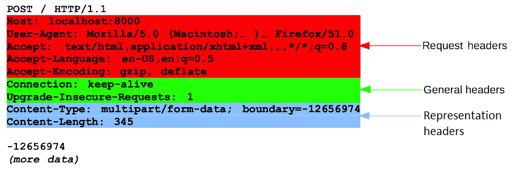

# HTTP의 이해

### [**HTTP (Hypertext Transfer Protocol)**](#user-content-fn-1)[^1]

&#x20;HTTP는 HTML 문서와 같은 리소스들을 가져올 수 있도록 해주는 프로토콜로 웹에서 이루어지는 모든 데이터의 교환의 기초

클라이언트-서버 프로토콜 , 수신자 측에 의해 요청이 초기화 되는 프로토콜  &#x20;

주로 클라이언트 서버들은 개별적인 메시지 교환에 의해 통신함

<figure><figcaption></figcaption></figure>

[^1]: 
